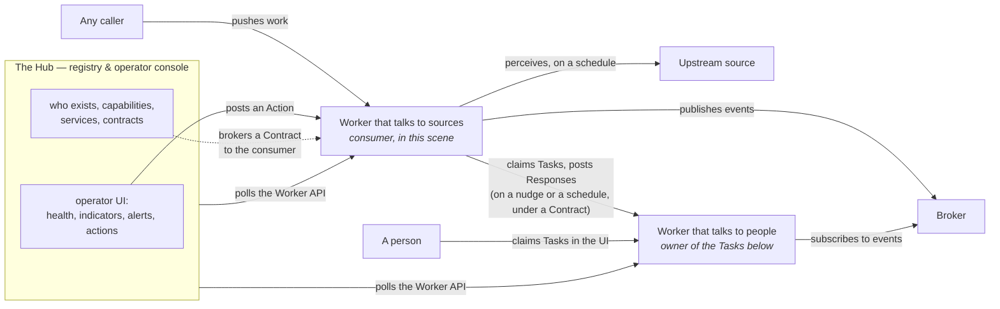

# A network of Workers, and the Hub that lets them collaborate

> How an organization runs many small systems without a central one owning their data. Each system
> is a **Worker**: it keeps its own state and stays authoritative over it. What it offers outward is
> **Events it publishes** through a broker, and a small **Worker API it answers when polled** —
> health, indicators, the Actions it accepts, and the Tasks and Alerts it has raised.
>
> Three principles drive the shape:
>
> 1. **Each Worker owns its state.** Nothing replicates into a privileged owner. A worker that
>    consumes another's events derives its own facts from them and raises its own Tasks; nobody
>    edits another worker's state except through an Action it published. How a worker keeps its
>    own state — including whether it derives some of it from events it consumes — is that
>    worker's business; the protocol prescribes only that the worker is authoritative over it.
> 2. **The protocol is HTTP and JSON Schema, and nothing else.** A worker built with none of our
>    tooling — a cron job in Python over Postgres — must be able to satisfy it completely.
> 3. **The Hub facilitates and monitors. It does not execute business logic and does not
>    remember.** It knows who exists, what each offers, and how each is doing; it brokers the
>    Contracts by which a consumer uses a Service, and then steps out of the way.
>
> **This document is the reasoning, not the normative text.** It explains why the protocol is
> shaped the way it is; `spec/` and `schemas/` say what a worker must do. Nothing here is closed:
> there is not yet enough operational experience to justify hard rules, and this document avoids
> writing any that would foreclose an option later. What is open on purpose is listed in
> [deliberately undecided](undecided.md).

## One kind of node, several platforms

Every system in the network is a Worker; where it runs is a placement decision, and the protocol
cannot tell the difference.

**Workers that talk to sources and to other workers** ask for durable single-writer state, timers
of their own, a low cost per wake-up, and proximity to the source. That is where continuous
derivation tends to fit — polling a high-volume feed, turning it into facts, holding the state that
deciding those facts requires. A platform built for that offers no human-facing surface, and such a
worker needs none. Ours run on Cloudflare.

A worker finds work in four ways, and they combine freely:

- **Claimed, on a schedule.** On a timer, the worker asks whatever holds the queue whether there is
  work for it.
- **Claimed, after a notification.** A best-effort nudge says there is work, and the worker claims
  it straight away.
- **Pushed to an endpoint.** Someone calls the worker with the work in hand.
- **Perception, on a schedule.** The worker reads an upstream source on a timer and derives what
  changed. The source has no idea the worker exists.

Notification and schedule are a deliberate pair: the nudge makes the common case prompt, and the
schedule makes it correct when a nudge is lost. A worker that claims only on a nudge is one dropped
request away from stalling silently. The pair also answers how a consumer learns of a new Task — by
the same means a worker finds any work: on a schedule, or after a best-effort nudge.

**Workers that talk to people** ask for the opposite: a store and a user interface close enough
together that building the screens is cheap, and a way for a person's action to become a message
the worker handles. They are workers first; the UI is how their Tasks get claimed and answered by
people. Ours run on Convex.

Placement is a weighing, not a rule. Set a worker's demands — how long a run takes, how often it
wakes, how much state it holds, whether a person must see it, what a new deployment costs — against
what each platform gives. A worker that fits within the limits of a Convex deployment that already
exists is often cheaper there than as a new deployment elsewhere; one whose runs are long or whose
timers are many is asking for what a durable object gives.

Three shapes recur often enough to have names; none is a different kind of node. A *domain service
app* has a custom UI in domain language and works the Tasks it raises and claims. A *teams app*
gives a person or team one view of the Tasks they hold across owners, by Capability. A *proxy*
wraps a system that cannot speak the protocol — Power Automate, Zapier, SAP — and answers for it.

**The Hub** is the one node that is not a worker: the registry and the operator's console. It
catalogs who exists and what each declares — Capabilities, events, Actions; it holds the Services
teams publish over them; it brokers the Contracts by which a consumer uses a Service; it polls how
each worker is doing. It holds nobody's data.

A **Service** is a name a team publishes over things workers already offer — these events, these
Task types, these Actions — and answers for. It is the unit a Contract is made over, never a unit
of execution: nothing is requested from a Service, and nothing flows through it. Using one means
subscribing to its events, claiming its Tasks or posting its Actions directly against the workers
behind it — which may be many, and which need not know which Service they serve.

Every arrow points from whoever initiates to whom it calls.

## Two connections, different in kind

**Published Events.** A worker publishes the facts it derives, to a broker, in a standard shape —
CloudEvents is the candidate. This is broker-agnostic by design: a worker may declare "I publish
`vehicle-moved` on Azure Event Hub", and the Hub catalogs *that it does, and with what shape*.
Anyone can subscribe and act on it without knowing how that worker is built. Task and Alert
lifecycle transitions are events too. The broker carries events and nothing else.

Subscribing is a long-lived consumer holding a checkpoint — Event Hub speaks AMQP or Kafka, not
HTTP — and not every platform can hold one. A worker on a platform without an always-on process
attaches through a thin subscriber beside it, an Azure Function on an Event Hub trigger say, that
keeps the cursor and pushes each event to the worker's endpoint. The worker owns the state; the
subscriber owns nothing but its position in the stream. Delivery is at least once, so the worker
deduplicates by event id.

**The Worker API.** Everything a worker exposes for reading or acting on, over HTTP and JSON
Schema: its **health**, the minimal answer to a poll, whose absence is the signal; its
**indicators**; its **Actions**, each with a schema and an address to post to; its **Tasks**,
exposed as current state so a late consumer sees what is open and not only what happened; and its
**Alerts**. The Hub is one client of this API; other workers are the main ones.

**Indicators, concretely.** Health says whether a worker works; indicators say whether it is worth
running. They are few, named, and carry the period they cover — a day, a month — because the
question they answer is a progression and a cost, not an instant: tokens consumed, hires resolved,
hires failed, how many had to be handed to a person. A worker declares which it publishes and what
each means.

**Health, concretely.** The shape is the one the cloud platforms and the IETF health-check draft
converge on — one top-level status and a map of named checks — with our own three values:
`healthy`, `degraded`, `unhealthy`, where that draft says `pass`, `warn` and `fail`. Each check
carries its own status and a short human-readable detail: the upstream
source, the broker, the store, whatever the worker depends on. `healthy` and `degraded` answer
HTTP 200 and `unhealthy` answers 503, so a poller that reads only the status code still learns the
one thing that matters. The envelope is fixed; which checks a worker reports, and what makes it
`degraded`, are the worker's to declare.

### Why pulled, and not pushed

The least obvious decision here, stated directly: **a dead worker is detected because the poll
fails.** If workers pushed their status, silence would be ambiguous — a worker that has gone down,
one whose credentials expired, and one that was never registered correctly all produce exactly the
same signal, and telling them apart needs a second mechanism that exists only to watch for absence.
Polling collapses that: the Hub already knows who should answer, and a worker that does not answer
is a fact, immediately.

The same argument holds for Tasks between workers: a consumer reads the Tasks it may claim from
the owner's API, and posts its Response to an owner it already knows.

### The payoff: the operator's UI is written once

The console renders a form from a JSON Schema it did not author, and posts the result to an
address it does not understand, on behalf of a worker whose domain it has never heard of. So does a
teams app, for Tasks instead of Actions. Every worker that speaks the protocol inherits that
interface for free; adding one adds no code to the Hub and teaches it nothing about invoices,
vehicles or shipments. That uniformity is the only way a small team operates a growing number of
systems.

## Tasks: delegation without dependency

An event is a fact with no addressee; publishing one commits nobody to anything. When a worker
needs something *done*, it raises a Task.

A **Task** is a condition the worker evaluates over its own facts. While the condition holds, the
Task exists; it names the **Actions** that may resolve it — a closed list, not an instruction — and
the **Capability** needed to perform them. A consumer with that Capability — another worker, or a
person through an app — claims the Task and acts. **Nothing the consumer does closes the Task.**
The owner never waits for a Response; it re-evaluates its condition when one arrives, and when the
condition no longer holds the Task is gone. Nobody declares it done.

This inverts the dependency rather than removing it. The consumer knows the owner — the same way a
subscriber knows the shape of the event it consumes. The owner knows nobody. That is the direction
the network already accepts for events.

**Capability** is the keystone, and it is concrete: the Task types a worker declares it answers,
each with its payload and response schemas. A Task requires one; a worker or a person declares
one; the Hub catalogs by it. It is the *unit of discovery*: the owner names a Task type, never an
actor, and the Hub answers "who answers it". The owner's logic names no actor, exactly as a
publisher names no subscriber; its runtime records who claimed, because refusing a late Response
requires knowing who holds the Claim. That is what keeps a Task from becoming a dependency on a
particular consumer.

**A Task and a Claim are two objects with two lifecycles.** A Task closes by *condition*: the owner
derives its status, and when the condition stops holding the Task disappears, whatever anyone
said. A **Claim** closes by *declaration or by lease*: the holder reports `done`, `failed` or
`released`, or its lease lapses and the owner reclaims the work for someone else. Claiming is
exclusive — the owner grants one lease per Task and refuses a second claim of a held one; its store
settles contention by first commit, and the owner needs no policy for that.

Failure is counted over Claims, never over the condition: the owner keeps, beside the Task, how
many Claims have failed and how many lapsed without a word, and stops granting new leases past a
cap. The Task itself is untouched by any of it — its condition still holds, so it still exists. A
Task that has outlived several failed Claims is a signal to an operator, not a stuck queue.

A **Response** is therefore two things: the Action posted into the owner, and the outcome declared
on the Claim. It may carry the cost and elapsed time of the execution; what happens to those
numbers is undecided.

**Alerts** are conditions an operator should see. An Alert may carry Actions; a Task additionally
requires a Capability and a Claim. A silent vehicle is a Task for whoever can check it; a worker
whose credentials expire in three days is an Alert for the Hub.

**Alarms** are something else again: a worker waking *itself* at a future time to re-evaluate.
They are neither Tasks nor Alerts, and are named here only so nobody calls them either.

## Contracts: how a consumer comes to use a Service

Workers register with the Hub, and teams publish Services over them. A consumer that needs a
Service — wired by an operator ahead of time, or asking the Hub at runtime who answers a Task type
— obtains a **Contract**: which of the Service's events, Task types and Actions it may use, under
which credentials. Everything with the shape of a schema belongs to the workers and is derived,
never stored; the Hub stores only the agreement and the credentials, so a Contract cannot drift
from the workers behind it. Discovery is by Task type, which is to say by Capability, never by
Task instance.

Once a Contract exists, the consumer reads Tasks from the owner's API and posts Responses to it
directly. The Hub is not in the path — if it aggregated open Tasks and routed them, it would be a
dependency of execution and would have to remember, and both principles would fall. **The network
runs with the Hub down.**

## Settings are an Action

Configuration is not a separate mechanism. A worker publishes an Action, `configure`, whose schema
is the schema of its settings; the console renders the form from it as it would for any Action,
and may give it a fixed place. The worker validates and stores the result; the Hub keeps no copy.
A worker that starts without configuration raises a Task requiring that Action, with the Capability
to operate it — same mechanism, no special path.

## The constraints that keep it honest

- **Platform independence.** The protocol is HTTP and JSON Schema so that a worker built with none
  of our libraries can satisfy it fully. That constrains what may ever enter the protocol, and the
  constraint is the point.
- **The Hub does not execute.** Schedules, derivation and connections to foreign APIs live in the
  workers; the Hub posts Actions from the console and nothing else.
- **The Hub does not remember.** A Task's lifecycle belongs to the worker that raised it; settings
  live in the worker. The Hub keeps its own management state — the registry, the Contracts — never
  state on a worker's behalf.
- **Each Worker stays authoritative.** State is read where it lives. A consumer may cache, and owns
  the consequences of caching.
- **Ownership is strict.** Facts belong to whoever derived them, events to whoever published them,
  Tasks to whoever raised them.
- **Nothing is closed.** Where this document is silent, the option is open.

## One worked case

A telemetry worker on Cloudflare polls a GPS source every minute, derives motion facts per vehicle
— movement, stops — and publishes them as events. It detects silence itself, with its own timer
over indexed state, and publishes `signal.lost` when a vehicle has gone quiet past a threshold. It
exposes health and indicators to the Hub: how many vehicles reported, how many are silent. It raises
no Tasks and does not know who listens.

A fleet operations app on Convex subscribes to those events and derives its own facts: trips, and
which silent vehicles matter. From a `signal.lost` event it may raise the Task *verify silent
vehicle*, requiring the Action *record verification* and the Capability *fleet verification*. A
person with that Capability claims it — from the app's own UI, or from a teams app under a Contract
the Hub brokered — verifies, and posts the Response: the verification, and `done` on the Claim.
The app re-evaluates: the vehicle reported again, or a verification is on record, so the condition
is gone and the Task closes.

The worker owns motion and silence; the app owns trips and the Task; the Hub owns the Contracts and
watches. Nobody touches another's state.

## Dictionary

| Term | Definition |
|---|---|
| **Worker** | The only kind of node. Owns its state, publishes Events, and answers a Worker API. Everything below hangs off it. |
| **Hub** | The one node that is not a Worker: the registry and the operator's console. It catalogs what Workers declare and polls how each is doing. It executes nothing and holds no Worker's state. |
| **Worker API** | What a Worker answers when polled, over HTTP and JSON Schema: its health, its indicators, the Actions it accepts, and the Tasks and Alerts it has raised. |
| **Indicator** | A named quantity a Worker exposes over a period it declares — cost, volume, outcomes. Health says whether a Worker works; indicators say whether it is worth running. |
| **Action** | An operation a Worker accepts, published with a schema and an address. The only way to act on a Worker. |
| **Task** | A condition a Worker evaluates over its own facts that, while it holds, requires one of a closed list of Actions from someone holding the Capability it names. Closes only when the condition disappears. |
| **Capability** | The Task types a Worker or person declares it answers, each with its payload and response schemas. What a Task requires, and what the Hub catalogs by. |
| **Claim** | One consumer's exclusive lease on a Task. Closes by declaration — `done`, `failed`, `released` — or by expiry, after which the owner reclaims. |
| **Response** | What a consumer posts to the owner: the Action performed, and the outcome declared on the Claim. Does not close the Task. |
| **Event** | A fact published to the broker with a shape declared in the Hub. No addressee, no commitment. |
| **Alert** | A condition an operator should see. May carry Actions; asks no Claim. |
| **Alarm** | A Worker waking itself at a future time to re-evaluate. Neither a Task nor an Alert. |
| **Service** | A name a team publishes over what Workers already offer — Events, Task types, Actions — and answers for. The unit a Contract is made over; nothing is requested from it. |
| **Contract** | An agreement between a consumer and a Service, brokered by the Hub: which of its Events, Task types and Actions the consumer may use, with credentials. Only the agreement and the credentials are stored; execution runs over it, not through the Hub. |
