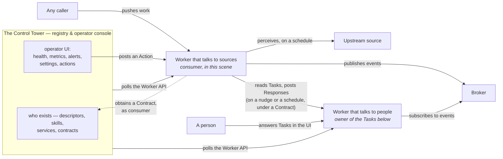

# A network of Workers, and the Control Tower that watches over them

> How an organization runs many small systems without a central one owning their data. Each system
> is a **Worker**: it keeps its own state and stays authoritative over it. What it offers outward is
> **Events it publishes** through a broker, and a small **Worker API it answers when polled** — a
> Descriptor of what it implements, then health, metrics, the Actions it accepts, the settings
> it holds, and the Tasks and Alerts it has raised.
>
> One role stands apart, and it is a role and not a kind of node. The **Control Tower** knows who
> exists, what each offers and how each is doing; it brokers the Contracts by which one Worker comes
> to use another's work, and then the work runs without it — as aircraft already cleared keep
> flying when the tower goes quiet.
>
> Four principles drive the shape:
>
> 1. **Each Worker owns its state.** Nothing replicates into a privileged owner. A worker that
>    consumes another's events derives its own facts from them and raises its own Tasks; nobody
>    edits another worker's state except through an Action it published. How a worker keeps its
>    own state — including whether it derives some of it from events it consumes — is that
>    worker's business; the protocol prescribes only that the worker is authoritative over it.
> 2. **The Worker API is HTTP and JSON Schema, and nothing else.** A worker built with none of our
>    tooling — a cron job in Python over Postgres — must be able to satisfy it completely. Events
>    travel over whatever broker a worker declares, which is the one place another transport
>    appears.
> 3. **The Tower is in nobody's execution path, and remembers nothing on a worker's behalf.** It
>    knows who exists, what each offers, and how each is doing; it brokers the Contracts by which a
>    consumer uses a Service, and then steps out of the way. What it works out about the fleet from
>    what it observed is its own, exactly as a worker's facts are its own — REG-24 is where the
>    invariant binds, by forbidding an owner to call the Tower in order to validate a Contract's
>    credential.
> 4. **A Descriptor is the whole floor, and everything above it is optional.** Capabilities are
>    declared or left out freely, in any combination including none. A worker that serves only a
>    Descriptor is enrolled, catalogued and reachable, and nothing beyond that is a condition of
>    being known — so a worker joins with what it already has, and is seen further as it offers
>    more: monitored once it declares `health`, measured once it declares `metrics`, given work
>    once it declares `tasks`. Conformance is whether a worker can be read and believed, never
>    whether it is worth enrolling.
>
> **This document is the reasoning, not the normative text.** It explains why the protocol is
> shaped the way it is; `spec/` and `schemas/` say what a worker must do. Nothing here is closed:
> there is not yet enough operational experience to justify hard rules, and this document avoids
> writing any that would foreclose an option later. What is open on purpose is listed in
> [deliberately undecided](undecided.md).

## Dictionary

Every term the rest of this document uses, in an order where each one is defined using only the
terms above it, as far as the terms allow: **Worker** comes first and names what hangs off it, and
**Task** and **Skill** define each other. Read it first, or skip it and come back — the
argument earns each of these in turn.

| Term | Definition |
|---|---|
| **Worker** | The only kind of node. Owns its state, publishes Events, and answers a Worker API. Everything below hangs off it. |
| **Fact** | Something a Worker derived and is authoritative over. Facts belong to whoever derived them; nobody else may write them. |
| **Capability** | A part of this protocol a Worker implements, from a closed list the spec names — health, metrics, actions, alerts, tasks, events — each with a version of its own. A Worker declares which it implements; a verifier ignores one it does not know. |
| **Descriptor** | The document a Worker serves at a route the spec fixes: its own id, distinct from where it lives; the Capabilities it implements, with the schemas of each and, where one answers over HTTP, its address; and the edition of this protocol it speaks. Everything anyone knows about a Worker before calling it is read from here. |
| **Control Tower** | A role, not a kind of node — the Tower, for short: the registry and the operator's console. It catalogs what Workers declare in their Descriptors, brokers the Contracts between them, and polls how each is doing. It holds no Worker's state, and nothing it offers is in the path of a call. A Tower that serves a Descriptor is a Worker like any other; what stays asymmetric is that every Worker reaches it by configuration rather than by discovery. |
| **Metric** | A named quantity a Worker exposes over a period it declares, with a unit and no valuation — cost, volume, outcomes. Health says whether a Worker works; metrics say what it did. |
| **Action** | An operation a Worker accepts, published with a schema and an address. The only way to act on a Worker that the protocol knows of; whatever else a Worker answers is its own business, and no console, catalog or Contract sees it. |
| **Task** | A condition a Worker evaluates over its own Facts that, while it holds, requires one of a closed list of Actions from someone holding the Skill it names. Carries the instant its condition began, and closes only when that condition disappears. |
| **Skill** | What a Worker or a person knows how to do in its domain, stated as the Task types it answers, each with its payload and response schemas. What a Task requires, and what the Tower catalogs by. |
| **Nudge** | A best-effort notification that there is something to do. Carries no payload and no guarantee; whoever receives one reads as it would have on its next schedule. Losing one costs latency, never work. |
| **Response** | The Action a consumer posts to the owner in answer to a Task. Does not close it: the owner re-evaluates, and the condition closes or does not. |
| **Event** | A Fact published for anyone to consume, with a shape declared in the Worker's own Descriptor. No addressee, no commitment. |
| **Broker** | The transport Events travel over. Each Worker declares which one it publishes to; the protocol names none, and nothing but Events crosses it. |
| **Alert** | A condition an operator should see. May carry Actions; requires no Skill. |
| **Worker API** | What a Worker answers when polled, over HTTP and JSON Schema: its Descriptor, and behind it the Capabilities it declares — health, metrics, the Actions it accepts, the settings it holds, and the Tasks and Alerts it has raised. |
| **Alarm** | A Worker waking itself at a future time to re-evaluate. Neither a Task nor an Alert. |
| **Teams app** | A Worker that gives a person or team one view of the Tasks they hold across owners, by Skill. A recurring shape, not a kind of node: the protocol does not know the term. |
| **Service** | A name a team publishes over what Workers already offer — Events, Task types, Actions — and answers for. The unit a Contract is made over; nothing is requested from it. |
| **Contract** | An agreement between a consumer and a Service, brokered by the Tower: which of its Events, Task types and Actions the consumer may use, with credentials. Only the agreement and the credentials are stored; execution runs over it, not through the Tower. |

## One kind of node, several platforms

Every system in the network is a Worker; where it runs is a placement decision, and the protocol
cannot tell the difference.

**Workers that talk to sources and to other workers** ask for durable single-writer state, timers
of their own, a low cost per wake-up, and proximity to the source. That is where continuous
derivation tends to fit — polling a high-volume feed, turning it into facts, holding the state that
deciding those facts requires. A platform built for that offers no human-facing surface, and such a
worker needs none. Ours run on Cloudflare.

A worker finds work in four ways, and they combine freely:

- **Taken, on a schedule.** On a timer, the worker asks whoever raised the work whether there is
  any for it.
- **Taken, after a notification.** A best-effort nudge says there is work, and the worker reads
  straight away.
- **Pushed to an endpoint.** Someone calls the worker with the work in hand. If the worker wants
  the protocol to see that door — a console to render it, a Contract to cover it — it publishes it
  as an Action; otherwise it is an endpoint like any other the worker chooses to serve, and the
  protocol has no opinion about it.
- **Perception, on a schedule.** The worker reads an upstream source on a timer and derives what
  changed. The source has no idea the worker exists.

Notification and schedule are a deliberate pair: the nudge makes the common case prompt, and the
schedule makes it correct when a nudge is lost. A worker that reads only on a nudge is one dropped
request away from stalling silently. The pair also answers how a consumer learns of a new Task — by
the same means a worker finds any work: on a schedule, or after a best-effort nudge.

Pushing needs no such pair, for a reason worth stating: whoever pushes still holds the work, sees
the call fail and retries. A nudge is different precisely because it carries nothing — lose it and
nobody is holding anything, which is why something else has to come round eventually.

**Workers that talk to people** ask for the opposite: a store and a user interface close enough
together that building the screens is cheap, and a way for a person's action to become a message
the worker handles. They are workers first; the UI is how their Tasks get answered by
people. Ours run on Convex.

Placement is a weighing, not a rule. Set a worker's demands — how long a run takes, how often it
wakes, how much state it holds, whether a person must see it, what a new deployment costs — against
what each platform gives. A worker that fits within the limits of a Convex deployment that already
exists is often cheaper there than as a new deployment elsewhere; one whose runs are long or whose
timers are many is asking for what a durable object gives.

Three shapes recur often enough to have names; none is a different kind of node. A *domain service
app* has a custom UI in domain language and works the Tasks it raises. A *teams app*
gives a person or team one view of the Tasks they hold across owners, by Skill. A *proxy*
wraps a system that cannot speak the protocol — Power Automate, Zapier, SAP — and answers for it.

**The Control Tower** is the registry and the operator's console. It catalogs who exists and what
each declares — read from each worker's Descriptor, together with the Skills the worker or its
people answer for; it holds the Services teams publish over them; it brokers the Contracts by which
a consumer uses a Service; it polls how each worker is doing. The registry is derived from those
Descriptors: enrolling a worker is a URL and a credential, and the rest is read. It holds nobody's
data.

*Control Tower* names a role, not a product and not a kind of node: whatever enrolls Workers, keeps
their Descriptors, brokers Contracts and polls is one, and a Worker must be legible to any of them.
A Tower that serves a Descriptor is a Worker like any other, and nothing in `spec/` either requires
that or forbids it — what it derives about the fleet would be its own facts, exposed through the
same Capabilities as anyone's. Three asymmetries survive that and are worth naming, because each is
a place where the network is not uniform:

- **Every Worker reaches its Tower by configuration, never by discovery.** Nothing is looked up;
  somebody wrote an address down. A Tower is found the way the first thing in any network is found.
- **Enrollment starts with a person.** REG-26 has somebody record a base URL and a credential, and
  its argument says why a handshake would only move the same trust one step. Whatever enrolls the
  first Tower is outside every mechanism described here, for the same reason.
- **Nothing a Tower offers is in the path of a call.** REG-24 is the binding form of it. This is the
  one asymmetry that would not survive being treated as a mere convention: a Tower whose Tasks or
  Actions were needed to *do* work, rather than to *obtain* it, would make its availability a
  precondition of the whole network.

What none of that requires is a section of `spec/` about the Tower's own surfaces. Whether a Tower
exposes an enrollment surface at all is open in [registration](../spec/registration.md), and this
specification says what a Worker serves — a Control Tower product is a named non-goal in
[spec/README.md](../spec/README.md).

The name is a metaphor carried on purpose. A tower sees all the traffic and flies none of it; when
it goes quiet, whoever is already cleared continues on the last clearance and whoever is not waits
— which is exactly the claim made under Contracts below. Where the metaphor ends: a real tower
sequences traffic in flight, and this one does not. A Contract, once granted, is the clearance.

Teams also talk about a Service — an issue raised against it, a question about what it answers
for. A Tower may host that conversation; the protocol does not see it, and it is neither a Task
nor an Alert.

A worker's **lifecycle** is the same kind of thing, and it is worth saying so rather than leaving
the silence to be read as an oversight. Preparing, active, retired — whatever phases a Tower names
— are qualifications a Tower keeps about a worker, put there by an operator or worked out from what
the Tower already holds. A worker declares no phase, the Descriptor carries none, and no file in
`spec/` defines one.

It sits with the Tower because enrolling is already a human act: somebody forms an opinion about a
worker by writing its URL down, retiring is the symmetric act, and *not yet* is the same person
saying the opinion is not formed. That is an opinion held about a worker, not a fact the worker
owns, and the worker has no use for it. A declared phase was considered and buys little. Two
workers running side by side while one replaces the other is already what a Service does — both
stand behind it, Contracts reach both, and metrics let an operator compare them. Telling a retired
worker from a dead one cannot rest on a declaration anyway, since a worker that dies declares
nothing and somebody has to go and look either way. And what only the worker can do while it
retires — stop raising Tasks, drain what it holds — is its own business, seen through `tasks` and
`health` without needing a name.

What does cross into the protocol is narrower than it looks, and two thirds of it is already
answered: HLTH-4 says what a worker answers before it has established its state, and NAME-2 forbids
reusing a retired worker's id for a different thing. What is left open is what becomes of a Contract
granted over a worker that is being retired, which belongs with the rest of what a Contract carries.

A **Service** is a name a team publishes over things workers already offer — these events, these
Task types, these Actions — and answers for. It is the unit a Contract is made over, never a unit
of execution: nothing is requested from a Service, and nothing flows through it. Using one means
subscribing to its events, reading its Tasks or posting its Actions directly against the workers
behind it — which may be many, and which need not know which Service they serve.

Every arrow points from whoever initiates to whom it calls.

## Two connections, different in kind

**Published Events.** A worker publishes the facts it derives, to a broker, in a standard shape —
CloudEvents 1.0 is adopted (EVT-1), and no binding is fixed. This is broker-agnostic by design: a
worker may declare "I publish `vehicle-moved` on Azure Event Hub", and the Tower catalogs *that it
does, and with what shape*. Anyone can subscribe and act on it without knowing how that worker is
built. Task and Alert lifecycle transitions are events too. The broker carries events and nothing
else.

Subscribing is a long-lived consumer holding a checkpoint — Event Hub speaks AMQP or Kafka, not
HTTP — and not every platform can hold one. A worker on a platform without an always-on process
attaches through a thin subscriber beside it, an Azure Function on an Event Hub trigger say, that
keeps the cursor and pushes each event to the worker's endpoint. The worker owns the state; the
subscriber owns nothing but its position in the stream. Delivery is at least once, so the worker
deduplicates by event id.

**The Worker API.** Everything a worker exposes for reading or acting on, over HTTP and JSON
Schema: its **Descriptor**, which says which of the rest it serves and where; its **health**, the
cheapest surface to poll and optional like the rest, since a Descriptor that stops answering carries
the same fact; its **metrics**; its **Actions**, each with a
schema and an address to post to; its **settings**, when it accepts `configure` — read here, written
only through that Action; its **Tasks**, exposed as current state so a late consumer sees what is
open and not only what happened; and its **Alerts**. The Tower is one client of this API; other
workers are the main ones.

**Metrics, concretely.** Health says whether a worker works; metrics say what it did. They are few,
named, and carry the period they cover — a day, a month — because the question they answer is a
progression and a cost, not an instant — a recruiting worker's, say: tokens consumed, hires
resolved, hires failed, how many had to be handed to a person. A worker declares which it publishes
and what each means, and whether its buckets may be summed — tokens consumed over two days is the
sum of the two, vehicles that reported is not, and a reader left to guess produces a number that is
wrong and plausible. The periods are five and fixed — hour, day, week,
month, year — cut in a time zone the worker declares, because a day is a calendar fact and two
readers without a zone disagree about what yesterday was. A metric may also declare dimensions it
can be filtered by, so that *tasks resolved* answers *of which type* without becoming three metrics.

**No verdict is published beside the number, and that is deliberate.** Whether a quantity is good
is a comparison against something somebody agreed or configured, and this protocol has no view
inside a worker's settings — a bound may live there, or in the worker's code, or nowhere. A worker
that decides one of its own numbers is wrong raises an **Alert**, which is the surface that exists
for a condition an operator should see; a consumer that agreed to something compares with what it
read. The metrics surface answers *how much*, and stops.

A worker never reads a Contract. What it can do is split a metric by the Contract each request came
under — it sees the credential, so it is authoritative over that — which is what makes any
consolidation above it possible. Whether this protocol names that breakdown is
[undecided](undecided.md), and [spec/metrics.md](../spec/metrics.md) carries the rest of the
questions.

**Health, concretely.** The shape is the one the cloud platforms and the IETF health-check draft
converge on — one top-level status and a map of named checks — with our own three values:
`healthy`, `degraded`, `unhealthy`, where that draft says `pass`, `warn` and `fail`. Each check
carries its own status and a short human-readable detail: the upstream source, the broker, the
store, whatever the worker depends on. **All three answer HTTP 200**, and the status is read from
the body; anything other than 200 means the worker did not answer, not that it is unwell. *This
paragraph previously said `unhealthy` answers 503. Drafting [spec/health.md](../spec/health.md)
found that 503 collides with ENDP-29, which classes it `retry`, so a poller obeying the spec would
back off from a worker that had answered it correctly — and a worker that is unwell would be
indistinguishable from one that is unreachable, which is the one distinction health exists to draw.
HLTH-5 is normative; a worker that wants the load-balancer behaviour serves that probe outside the
protocol.* The third value is for whoever reads the body: the console shows `degraded` as its own
state, and an operator decides whether a worker that works with one check failing is worth a Task
or worth leaving alone. The envelope is fixed; which checks a worker reports, and what makes it
`degraded`, are the worker's to declare.

### Why pulled, and not pushed

The least obvious decision here, stated directly: **a dead worker is detected because the poll
fails.** If workers pushed their status, silence would be ambiguous — a worker that has gone down,
one whose credentials expired, and one that was never registered correctly all produce exactly the
same signal, and telling them apart needs a second mechanism that exists only to watch for absence.
Polling collapses that: the Tower already knows who should answer, and a worker that does not answer
is a fact, immediately.

The same argument holds for Tasks between workers: a consumer reads the Tasks it may answer from
the owner's API, and posts its Response to an owner it already knows.

### The payoff: the operator's UI is written once

The console renders a form from a JSON Schema it did not author, and posts the result to an
address it does not understand, on behalf of a worker whose domain it has never heard of. So does a
teams app, for Tasks instead of Actions. Every worker that speaks the protocol inherits that
interface for free; adding one adds no code to the Tower and teaches it nothing about invoices,
vehicles or shipments. That uniformity is the only way a small team operates a growing number of
systems.

## The Descriptor: a Worker says what it implements

Not every Worker has every surface. The telemetry worker in the worked case below raises no Tasks,
and until it says so, nobody can know that except by trying. So a Worker serves a **Descriptor** at
a route the spec fixes, and it is the first thing anyone reads about it: the Worker's own id; the
**Capabilities** it implements, each with the schemas it answers with and, where it answers over
HTTP, the address it answers at; and its versions.

A Capability is a part of this protocol — health, metrics, actions with settings inside them,
alerts, tasks, events — and the list is closed; the spec names them. The word follows the
convention of LSP, MCP and WebDriver, where *capabilities* already means exactly this. A prefix is
reserved for a Worker to declare something of its own without breaking verification: a verifier
ignores what it does not know. Endpoints, registration and naming are not Capabilities; they cut
across all of them, and every Worker meets them.

Versions come in two, and both are needed. An umbrella version names the edition of this
specification a Worker speaks — *this worker speaks worker-protocol 0.1* — and is what gets cited,
and what lets a new Capability appear at all. A version per Capability lets `health` freeze while
`events` still moves, which is the grain at which each file of `spec/` already carries its
maturity marker.

The id is the Worker's own, and it is distinct from its URL: the URL is where a Worker is, the id
is who it is. A Worker that moves keeps its Contracts.

**The Tower's registry is derived entirely from Descriptors.** Enrolling a Worker is an operator
pasting a URL and a credential, and nothing else — no handshake, and no Worker registering itself.
That human act is the moment of trust: the Worker declares its identity and its team, and what
ties the declaration to reality is that a person put that URL there.

One consequence has to be faced. If the registry were read from Descriptors and nothing more, a
Worker that is down would vanish from the catalog, and an empty catalog is worse than an old one.
So **the Tower keeps a copy of the last Descriptor it saw from each Worker, with the time it saw
it.** This sits beside the principle that the Tower holds nothing schema-shaped of its own only if
it is said precisely: the Tower is authority over none of it, the copy is dated, and the Worker's
own Descriptor wins wherever the two differ.

## Tasks: delegation without dependency

An event is a fact with no addressee; publishing one commits nobody to anything. When a worker
needs something *done*, it raises a Task.

A **Task** is a condition the worker evaluates over its own facts. While the condition holds, the
Task exists; it names the **Actions** that may answer it — a closed list, not an instruction — and
the **Skill** needed to perform them. A consumer with that Skill — another worker, or a person
through an app — reads it and acts. **Nothing the consumer does closes the Task.** The owner never
waits for a Response; it re-evaluates its condition when one arrives, and when the condition no
longer holds the Task is gone. Nobody declares it done.

This inverts the dependency rather than removing it. The consumer knows the owner — the same way a
subscriber knows the shape of the event it consumes. The owner knows nobody. That is the direction
the network already accepts for events.

**Skill** is the keystone, and it is concrete: the Task types a worker declares it answers, each
with its payload and response schemas. A Task requires one; a worker or a person declares one; the
Tower catalogs by it. It is the *unit of discovery*: the owner names a Task type, never an actor,
and the Tower answers "who answers it". The owner's logic names no actor, exactly as a publisher
names no subscriber. That is what keeps a Task from becoming a dependency on a particular consumer.

A Task carries the instant its condition began, and that is the whole of its state. There is none
other to carry: it exists because something is true, and it is gone when that stops. What an
operator needs from it is *how long*, because a Task open since Tuesday is one nobody has answered
— the same reading an Alert's `since` gets, for the same reason.

**Two consumers may answer the same Task, and this protocol does not prevent it.** An Action that
declares an idempotency key is performed once however many times it is posted, and a condition a
first answer resolved is not there for a second. Where the work is expensive, or physical, or paid
for, the consumers of it coordinate among themselves — which is the party that can, since two
people in one teams app are two people in one application.

*This is where a Claim used to be: an exclusive lease a consumer took on a Task, with an expiry, a
fencing token and counts of what had failed. Sixteen rules of it are withdrawn, and
[tasks](../spec/tasks.md) carries the argument. The short of it is that a lease over a unit of work
is the primitive of a work queue, that `spec/README.md` names orchestration a non-goal, and that
the cost fell on the owner — who had to stand up a durable store to settle contention — while the
consumer's side of it was optional all along.*

A **Response** is therefore one call: an Action posted into the owner, under
[actions](../spec/actions.md) and nothing added. It may carry the cost and elapsed time of the
execution; what happens to those numbers is undecided.

**Alerts** are conditions an operator should see. An Alert may carry Actions; a Task additionally
requires a Skill and is discovered by it. A silent vehicle is a Task for whoever can check it; a
worker whose credentials expire in three days is an Alert for the Tower. Whether they were a
surface of their own was open for a while; [alerts](../spec/alerts.md) answers it and says why, and
the short version is that folding them into Tasks would have meant a Task type carrying an
exception to the rules that make a Task a Task.

**Alarms** are something else again: a worker waking *itself* at a future time to re-evaluate.
They are neither Tasks nor Alerts, and are named here only so nobody calls them either.

## Contracts: how a consumer comes to use a Service

Workers are enrolled with the Tower, and teams publish Services over them. A consumer that needs a
Service — wired by an operator ahead of time, or asking the Tower at runtime who answers a Task type
— obtains a **Contract**: which of the Service's events, Task types and Actions it may use, under
which credentials. Everything with the shape of a schema belongs to the workers; the Tower keeps a
dated copy of what each last declared and is authority over none of it, and what it stores as its
own is the agreement and the credentials — so a Contract is made over the workers' declarations
and can drift from them by no more than the age of that copy. Discovery is by Task type, which is
to say by Skill, never by Task instance.

Once a Contract exists, the consumer reads Tasks from the owner's API and posts Responses to it
directly. The Tower is not in the path — if it aggregated open Tasks and routed them, it would be a
dependency of execution and would have to remember, and both principles would fall. **Work already
under Contract runs with the Tower down**, which is the claim worth making and the narrow one: a
consumer that needs a *new* Contract, or credentials that have expired, waits for the Tower like
anyone else. What never waits is the work.

## Settings are an Action

Configuration is not a separate mechanism. A worker publishes an Action, `configure`, whose schema
is the schema of its settings; the console renders the form from it as it would for any Action,
and may give it a fixed place. The worker validates and stores the result; the Tower keeps no copy.
A worker that starts without configuration raises a Task requiring that Action, with the Skill to
operate it — same mechanism, no special path.

Because the Tower keeps no copy, a worker that accepts `configure` also exposes its current settings
for reading on the Worker API — otherwise the console has no way to show a form with anything in
it, and the only reader of a worker's configuration would be the worker itself. Reading is a
surface like health or metrics; writing stays an Action.

## The constraints that keep it honest

- **Platform independence.** The Worker API is HTTP and JSON Schema so that a worker built with
  none of our libraries can satisfy it fully. That constrains what may ever enter it, and the
  constraint is the point.
- **The Tower is in nobody's execution path.** No worker's work waits on it. It does post Actions —
  that is what the console is for — but it posts what an operator decided, never what it decided
  itself, and REG-24 forbids an owner to call it in order to validate a Contract's credential. What
  it does derive is about the fleet and from what it observed: DESC-20 has it record what a
  Descriptor declared and when an address stopped answering, REG-14 a Worker id that changed, REG-19
  a credential that was refused. Those are its own facts, and the earlier form of this line — *the
  Tower runs no business logic* — denied them while `spec/` required them. Schedules, derivation
  over a domain, and connections to foreign APIs still live in the workers.
- **The Tower remembers nothing on a worker's behalf.** A Task's lifecycle belongs to the worker
  that raised it; settings live in the worker. What the Tower keeps is its own: the registry, which
  is the dated copy of each Descriptor it last saw; the Contracts; the credentials; and whatever it
  has concluded about each worker, the phase it puts one in included. The line is ownership and not
  volume — nothing it holds is a fact a worker is authoritative over.
- **Each Worker stays authoritative.** State is read where it lives. A consumer may cache, and owns
  the consequences of caching.
- **Ownership is strict.** Facts belong to whoever derived them, events to whoever published them,
  Tasks to whoever raised them.
- **Nothing is closed.** Where this document is silent, the option is open.

## One worked case

A telemetry worker on Cloudflare polls a GPS source every minute, derives motion facts per vehicle
— movement, stops — and publishes them as events. It detects silence itself, with its own timer
over indexed state, and publishes `signal.lost` when a vehicle has gone quiet past a threshold. It
exposes health to the Tower — whether the GPS source answered, whether the broker took its last
publish — and metrics over the day: how many vehicles reported, how many fell silent, how many
of those came back on their own. It raises no Tasks and does not know who listens.

A fleet operations app on Convex subscribes to those events and derives its own facts: trips, and
which silent vehicles matter. From a `signal.lost` event it may raise the Task *verify silent
vehicle*, requiring the Action *record verification* and the Skill *fleet verification*. A
person with that Skill reads it — from the app's own UI, or from a teams app under a Contract the
Tower brokered — verifies, and posts the Response, which is the Action *record verification* and
nothing else. The app re-evaluates: the vehicle reported again, or a verification is on record, so
the condition is gone and the Task closes. Nobody told it to.

The worker owns motion and silence; the app owns trips and the Task; the Tower owns the Contracts
and watches. Nobody touches another's state.

